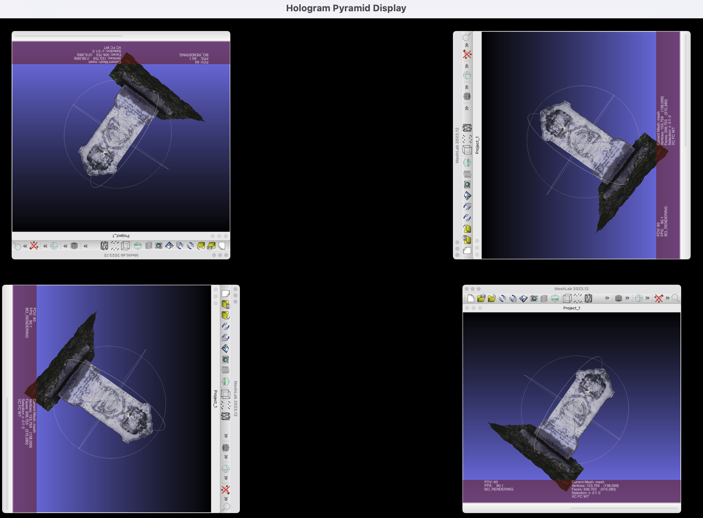

# Hologram Pyramid Display

A real-time desktop window capture system that creates holographic displays using the Pepper's ghost illusion with a transparent pyramid.


[](output.mp4)


Many years ago, student Alexis Mawko built a smartphone holographic projector as part of HIST3814 at Carleton University. Her write-up was posted by Shawn Graham (with permission) at [electricarchaeology](https://electricarchaeology.ca/2018/04/13/guest-post-alexis-mawko-lessons-from-warhol/). That example has long been percolating in my head: what if you could real-time stream whatever application you were working in to such a thing? And then we saw [this project by Gian Fernandes](https://www.instructables.com/Hologram-Display-Peppers-Ghost-Projector-Part-2/) using the [Pepper's Ghost illusion](https://en.wikipedia.org/wiki/Pepper's_ghost) to highlight and interpret a 3d print of Squamish BC. And we also came across this [piece about the London Underground and visualizing it with a pyramid/Pepper's Ghost effect](https://medium.com/data-science/holographic-london-underground-visualisation-b0462ae19d6e). Which all seemed neat.

So we're going to build a system to stream real-time windows through a pyramid. We're in the process of building a large display box. We'll use an older flat monitor we have handy to project. And we'll wire it up to one of our computers. There will also be a small mount for a Leap motion control. 

Why? Why do all this? Because we want to explore ways of interacting with cultural heritage data beyond the screen. This is just our first experiment.

NB: code is still developing. More functions to be added.

## Install dependencies:

```bash
pip install -r requirements.txt
```

## Make a pyramid

Then, you'll need a pyramid made out of transparent material like acrylic or perspex. The calculator at [https://hologram.kgabriel.dev/en-US/] might be helpful for generating a template that you can use for cutting. 

## Usage

Get your target application running. Then, in a terminal, `$python main.py`. Select the target window from the list. Maximize the screen.

usage: main.py [-h] [--title TITLE | --region X Y W H | --demo]

options:
  -h, --help        show this help message and exit
  --title TITLE     Title of the window to capture.
  --region X Y W H  Capture a specific screen region (x, y, width, height).
  --demo            Run in demo mode with a test pattern.

For macOS, window capture may require screen recording permissions. Go to system settings  -> privacy & security -> screen & system audio recording, and give the terminal permission to record screen/audio.

This hasn't been tested on a windows machine yet.



## Dependencies

For reference, I made a new conda Python 3.11.13 environment, and while everything necessary for the projects should be in the requirements.txt file, here's the complete pip list, just in case.

Package                 Version
----------------------- --------
absl-py                 1.4.0
astunparse              1.6.3
cachetools              5.3.1
gast                    0.4.0
google-auth             2.19.1
google-auth-oauthlib    1.0.0
google-pasta            0.2.0
jax                     0.4.11
libclang                16.0.0
MarkupSafe              2.1.3
MouseInfo               0.1.3
numpy                   1.24.3
oauthlib                3.2.2
opencv-python           4.8.1.78
opt-einsum              3.3.0
Pillow                  10.0.1
pip                     25.1.1
psutil                  7.0.0
pyasn1                  0.5.0
pyasn1-modules          0.3.0
PyAutoGUI               0.9.54
PyGetWindow             0.0.9
PyMsgBox                1.0.9
pyobjc-core             11.1
pyobjc-framework-Cocoa  11.1
pyobjc-framework-Quartz 11.1
pyperclip               1.9.0
PyRect                  0.2.0
PyScreeze               1.0.1
pytweening              1.2.0
requests-oauthlib       1.3.1
rsa                     4.9
rubicon-objc            0.5.1
setuptools              80.9.0
six                     1.16.0
tensorboard-data-server 0.7.0
tensorflow-estimator    2.12.0
termcolor               2.3.0
wheel                   0.45.1
wrapt                   1.14.1
